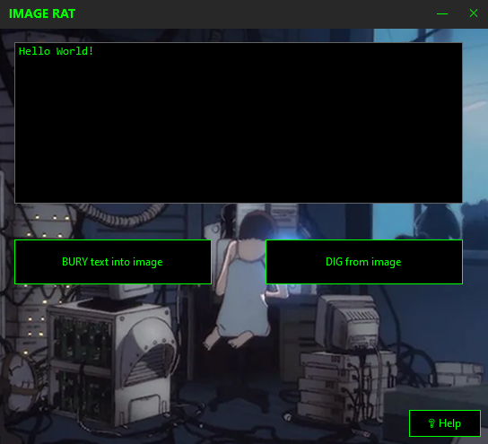

# 🐀 Image Rat

**Простая стеганография через LSB**


## 📦 Скачать

👉 [Скачать Image Rat v1.0](https://github.com/DeadRabbit66/ImageRat/releases/latest)

## ✨ Особенности

- 🐀 **BURY text into image** — прячет текст в PNG/JPG/BMP
- 🐀 **DIG from image** — извлекает текст из картинки
- 📁 **Drag & Drop** — перетащи картинку в окно
- 🔄 **Автоконвертация** — JPEG → PNG автоматически

## 📸 Скриншот


## 🚀 Быстрый старт

### BURY (спрятать текст)
1. Введите текст в поле
2. Нажмите «BURY text into image»
3. Выберите изображение (PNG, JPG, BMP)
4. Сохраните результат

### DIG (извлечь текст)
1. Нажмите «DIG from image»
2. Выберите картинку со скрытым текстом
3. Или просто перетащите картинку в окно!

## 🔗 Связка с Cryptic Wytch

Для криптографической стойкости сначала зашифруйте текст в [Cryptic Wytch](https://github.com/DeadRabbit66/CrypticWytch), а результат прячьте в Image Rat.

## ⚠️ Важные особенности

- JPEG/JPG автоматически конвертируются в PNG
- Оригинальные файлы НЕ изменяются
- Сохранённая картинка получает суффикс `_enc`
- Текст НЕ шифруется (только LSB)

## 🛠️ Сборка из исходников

```bash
git clone https://github.com/DeadRabbit66/ImageRat.git
cd ImageRat
dotnet build -c Release
